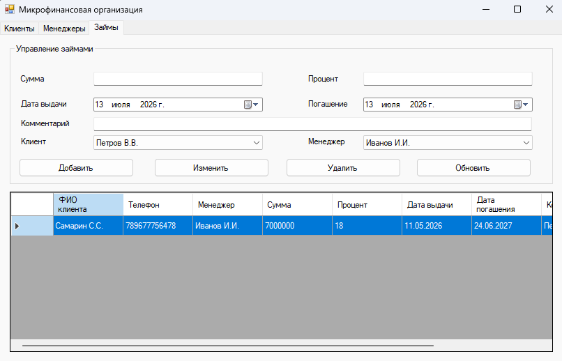

# MicrofinanceApp
Десктопное приложение для учета микрофинансовых операций на WinForms. Используются Entity Framework, SQLite и CRUD-операции для основных сущностей.
## Features
- Manage clients
- Manage loans
- Manage managers
- Store data in SQLite
- CRUD operations
- Entity Framework migrations
## Tech stack
- C#
- .NET Framework 4.8
- WinForms
- Entity Framework 6
- SQLite
## Architecture
- `Models` contains domain entities
- `Services` contains CRUD and persistence logic
- `Data` contains DbContext and SQLite configuration
- `Migrations` contains database migrations
- `Form1` contains the user interface
## Screenshots

